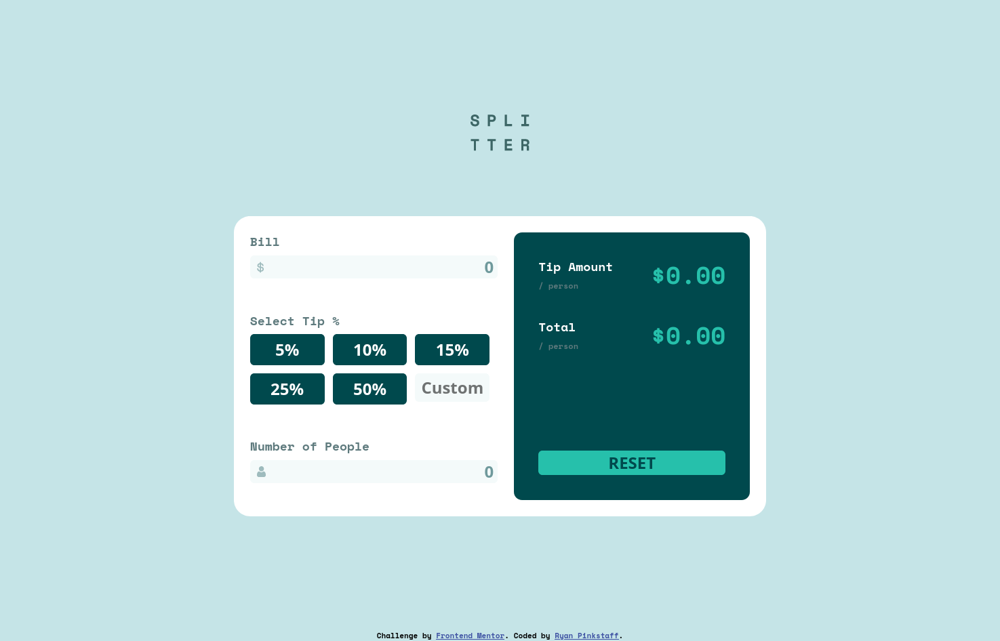

# Frontend Mentor - Tip calculator app solution

This is a solution to the [Tip calculator app challenge on Frontend Mentor](https://www.frontendmentor.io/challenges/tip-calculator-app-ugJNGbJUX). Frontend Mentor challenges help you improve your coding skills by building realistic projects.

## Table of contents

- [Overview](#overview)
  - [The challenge](#the-challenge)
  - [Screenshot](#screenshot)
  - [Links](#links)
- [My process](#my-process)
  - [Built with](#built-with)
  - [What I learned](#what-i-learned)
- [Author](#author)

## Overview

### The challenge

Users should be able to:

- View the optimal layout for the app depending on their device's screen size
- See hover states for all interactive elements on the page
- Calculate the correct tip and total cost of the bill per person

### Screenshot

### Links

- Solution URL: [Add solution URL here](https://github.com/rdpinkst/tip-calculator-app-main)
- Live Site URL: [Add live site URL here](https://rdpinkst.github.io/tip-calculator-app-main/)

## My process

The structure of this app was the first thing that needed to be built, coding up the semantic HTML5 markup.  CSS was then used to style the app, getting it looking as close to the design file pictures as possible.  With the app looking good on desktop, interactivity needed to be added.  Javascript came to the rescue.  Using javascript I manipulated the DOM, getting the input values for bill total, tip percentage, and number of people.  These values where then used to calculate the tip amount each person needed to pay, along with the total bill each person had to pay.  

### Built with

- Semantic HTML5 markup
- CSS 
- Flexbox
- CSS Grid
- Javascript

### What I learned

Building this project I saw how numbers act in javascript.  Not getting the number you thought you would get, but a number with many decimal places.  To correct this, when I changed the DOM I converted the number to a string with two decimal places.

## Author

- Frontend Mentor - [@rdpinkst](https://www.frontendmentor.io/profile/rdpinkst)

